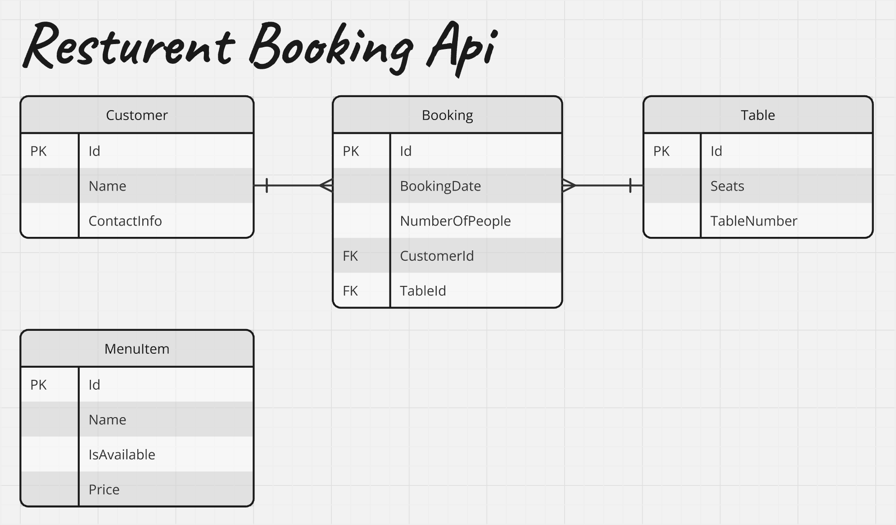

# Restaurant Booking API

## Overview

This project is a backend system for managing restaurant operations. It allows administrators to manage bookings, tables, customers, and the restaurant menu via a REST API. The system provides functionality to perform CRUD operations on customers, tables, bookings, and menu items, and ensures that the database operations are efficient and optimized.

## Technologies

- **.NET 8**
- **Entity Framework Core** (Code-First Approach)
- **SQL Server**
- **Swagger** for API documentation
- **Postman** for API testing

## ER Diagram

## Database Schema

The database consists of the following tables:

- **Tables**: Stores table information such as table number and number of seats.
- **Customers**: Stores customer data including name and contact information.
- **Bookings**: Stores booking data, linking customers to tables, along with the booking date and number of people.
- **MenuItems**: Stores menu items, including the name, price, and availability.

## API Endpoints

### Table Endpoints

- `GET /api/tables`: Retrieves all tables.
- `GET /api/tables/{id}`: Retrieves a specific table by its ID.
- `POST /api/tables`: Creates a new table.
- `PUT /api/tables/{id}`: Updates an existing table.
- `DELETE /api/tables/{id}`: Deletes a table by ID.

### Customer Endpoints

- `GET /api/customers`: Retrieves all customers.
- `GET /api/customers/{id}`: Retrieves a specific customer by ID.
- `POST /api/customers`: Creates a new customer.
- `PUT /api/customers/{id}`: Updates an existing customer.
- `DELETE /api/customers/{id}`: Deletes a customer by ID.

### Booking Endpoints

- `GET /api/bookings`: Retrieves all bookings.
- `GET /api/bookings/{id}`: Retrieves a specific booking by ID.
- `POST /api/bookings`: Creates a new booking. It checks if the table is available before creating the booking.
- `PUT /api/bookings/{id}`: Updates an existing booking.
- `DELETE /api/bookings/{id}`: Deletes a booking by ID.

### Menu Endpoints

- `GET /api/menuitems`: Retrieves all menu items.
- `GET /api/menuitems/{id}`: Retrieves a specific menu item by ID.
- `POST /api/menuitems`: Creates a new menu item.
- `PUT /api/menuitems/{id}`: Updates an existing menu item.
- `DELETE /api/menuitems/{id}`: Deletes a menu item by ID.
